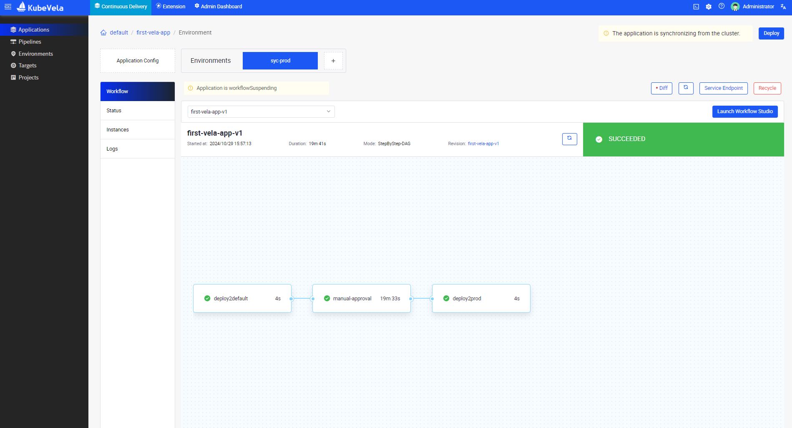
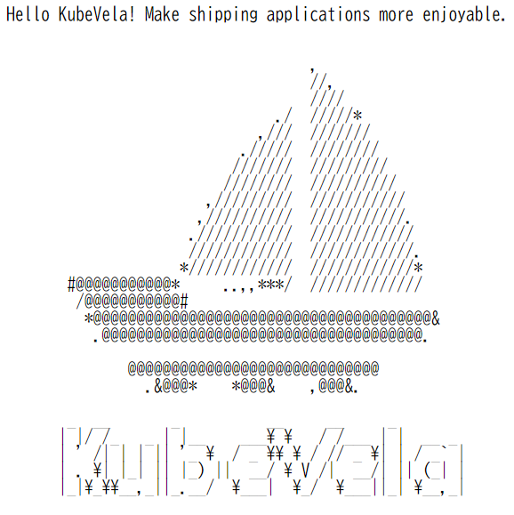

# Oracle Hangout Cafe Season 9 #2 Platform Engineering

セッション時に使用したデモ環境(KubeVela)の構築手順および資材置き場です。

環境は、Oracle Cloud Infrastructure（OCI）前提です。

# KubeVela Demo

コンピュートで以下のインスタンスを作成します。

- Compute
  - VM.Standard.E4.Flex
  - OCPU x 1
  - MEM 16GB
- OS
  - Ubuntu 22.24

## docker install

Set up Docker's apt repository.

```sh
sudo apt-get update
```
```sh
sudo apt-get install ca-certificates curl
```
```sh
sudo install -m 0755 -d /etc/apt/keyrings
```
```sh
sudo curl -fsSL https://download.docker.com/linux/ubuntu/gpg -o /etc/apt/keyrings/docker.asc
```
```sh
sudo chmod a+r /etc/apt/keyrings/docker.asc
```

Add the repository to Apt sources

```sh
echo \
  "deb [arch=$(dpkg --print-architecture) signed-by=/etc/apt/keyrings/docker.asc] https://download.docker.com/linux/ubuntu \
  $(. /etc/os-release && echo "$VERSION_CODENAME") stable" | \
  sudo tee /etc/apt/sources.list.d/docker.list > /dev/null
```
```sh
sudo apt-get update
```

Install the Docker packages

```sh
sudo apt-get install docker-ce docker-ce-cli containerd.io docker-buildx-plugin docker-compose-plugin
```

Docker Group Configure

```sh
sudo usermod -aG docker ubuntu
```
```sh
newgrp docker
```
```sh
docker run hello-world
```

## kubectl install

```sh
curl -LO "https://dl.k8s.io/release/$(curl -LS https://dl.k8s.io/release/stable.txt)/bin/linux/amd64/kubectl"
```
```sh
chmod +x ./kubectl
```
```sh
sudo mv ./kubectl /usr/local/bin/kubectl
```
```sh
kubectl version --client
```

## kind install

```sh
[ $(uname -m) = x86_64 ] && curl -Lo ./kind https://kind.sigs.k8s.io/dl/v0.20.0/kind-linux-amd64
```
```sh
chmod +x ./kind
```
```sh
sudo mv ./kind /usr/local/bin/kind
```

## kind cluster create

```sh
cat <<EOF > kind-cluster-config.yaml
kind: Cluster
apiVersion: kind.x-k8s.io/v1alpha4
nodes:
  - role: control-plane
  - role: worker
  - role: worker
EOF
```

```sh
kind create cluster --config kind-cluster-config.yaml
```

```sh
kubectl get nodes
```
```sh
NAME                 STATUS   ROLES           AGE   VERSION
kind-control-plane   Ready    control-plane   60s   v1.27.3
kind-worker          Ready    <none>          27s   v1.27.3
kind-worker2         Ready    <none>          29s   v1.27.3
```

## KubeVela CLI install

```sh
curl -fsSl https://kubevela.io/script/install.sh | bash
```
```sh
vela version
```
```sh
CLI Version: 1.9.13
Core Version: 
GitRevision: git-d56da069
GolangVersion: go1.19.13
```

## KubeVela install

```sh
vela install
```
```sh
.
.
.
KubeVela control plane has been successfully set up on your cluster.
If you want to enable dashboard, please run "vela addon enable velaux"
```

## vela dashboard

ダッシュボード有効化

```sh
vela addon enable velaux
```
```sh
Addon velaux enabled successfully.
Please access addon-velaux from the following endpoints:
+---------+---------------+-----------------------------------+--------------------------------+-------+
| CLUSTER |   COMPONENT   |     REF(KIND/NAMESPACE/NAME)      |            ENDPOINT            | INNER |
+---------+---------------+-----------------------------------+--------------------------------+-------+
| local   | velaux-server | Service/vela-system/velaux-server | velaux-server.vela-system:8000 | true  |
+---------+---------------+-----------------------------------+--------------------------------+-------+
    To open the dashboard directly by port-forward:

    vela port-forward -n vela-system addon-velaux 8000:8000

    Please refer to https://kubevela.io/docs/reference/addons/velaux for more VelaUX addon installation and visiting method.
```

新規にターミナルを起動後、以下コマンドを実行

```sh
vela port-forward -n vela-system addon-velaux 8080:8000
```

ブラウザ画面で、任意のアカウント名、パスワード、メールアドレスを設定、設定後、そのアカウント名とパスワードでログイン。

## sample application demo

sample manifest

```sh
apiVersion: core.oam.dev/v1beta1
kind: Application
metadata:
  name: first-vela-app
spec:
  components:
    - name: express-server
      type: webservice
      properties:
        image: oamdev/hello-world
        ports:
         - port: 8000
           expose: true
      traits:
        - type: scaler
          properties:
            replicas: 1
  policies:
    - name: target-default
      type: topology
      properties:
        # The cluster with name local is installed the KubeVela.
        clusters: ["local"]
        namespace: "default"
    - name: target-prod
      type: topology
      properties:
        clusters: ["local"]
        # This namespace must be created before deploying.
        namespace: "prod"
    - name: deploy-ha
      type: override
      properties:
        components:
          - type: webservice
            traits:
              - type: scaler
                properties:
                  replicas: 2
  workflow:
    steps:
      - name: deploy2default
        type: deploy
        properties:
          policies: ["target-default"]
      - name: manual-approval
        type: suspend
      - name: deploy2prod
        type: deploy
        properties:
          policies: ["target-prod", "deploy-ha"]
```

prod namespace create

```sh
vela env init prod --namespace prod
```
```sh
environment prod with namespace prod created
```

manifest apply

```sh
vela up -f https://kubevela.net/example/applications/first-app.yaml
```
```sh
Applying an application in vela K8s object format...
✅ App has been deployed 🚀🚀🚀
    Port forward: vela port-forward first-vela-app -n prod
             SSH: vela exec first-vela-app -n prod
         Logging: vela logs first-vela-app -n prod
      App status: vela status first-vela-app -n prod
        Endpoint: vela status first-vela-app -n prod --endpoint
Application prod/first-vela-app applied.
```

ステータス確認
default ネームスペースにデプロイされていることを確認

```sh
vela status first-vela-app
```
```sh
About:

  Name:         first-vela-app               
  Namespace:    prod                         
  Created at:   2024-10-29 06:57:13 +0000 UTC
  Status:       workflowSuspending           

Workflow:

  mode: StepByStep-DAG
  finished: false
  Suspend: true
  Terminated: false
  Steps
  - id: door8vxa5q
    name: deploy2default
    type: deploy
    phase: succeeded 
  - id: pyz97kzrju
    name: manual-approval
    type: suspend
    phase: suspending 
    message: Suspended by field suspend

Services:

  - Name: express-server  
    Cluster: local  Namespace: default
    Type: webservice
    Healthy Ready:1/1
    Traits:
      ✅ scaler
```

default namespace のアプリケーションをブラウザで確認
新規ターミナルを起動して、以下コマンドを実行
```sh
vela port-forward first-vela-app 8000:8000
```

手動承認コマンド実行
```sh
vela workflow resume first-vela-app
```

ステータス確認
prod ネームスペースにデプロイされていることを確認
```sh
vela status first-vela-app
```
```sh
About:

  Name:         first-vela-app               
  Namespace:    prod                         
  Created at:   2024-10-29 06:57:13 +0000 UTC
  Status:       running                      

Workflow:

  mode: StepByStep-DAG
  finished: true
  Suspend: false
  Terminated: false
  Steps
  - id: door8vxa5q
    name: deploy2default
    type: deploy
    phase: succeeded 
  - id: pyz97kzrju
    name: manual-approval
    type: suspend
    phase: succeeded 
  - id: i4z8vqj559
    name: deploy2prod
    type: deploy
    phase: succeeded 

Services:

  - Name: express-server  
    Cluster: local  Namespace: prod
    Type: webservice
    Healthy Ready:2/2
    Traits:
      ✅ scaler
  - Name: express-server  
    Cluster: local  Namespace: default
    Type: webservice
    Healthy Ready:1/1
    Traits:
      ✅ scaler
```

ポートフォワーディング（ポート番号:8080）しているので、ダッシュボードから可視化された状態で確認可能



ポートフォワーディング（ポート番号:8000）からブラウザで、デプロイされているアプリケーションの確認



アプリケーションの削除

```sh
vela delete first-vela-app
```
```sh
Are you sure to delete the application prod/first-vela-app (y/n)y
Start deleting appplication prod/first-vela-app
Delete appplication prod/first-vela-app succeeded
```